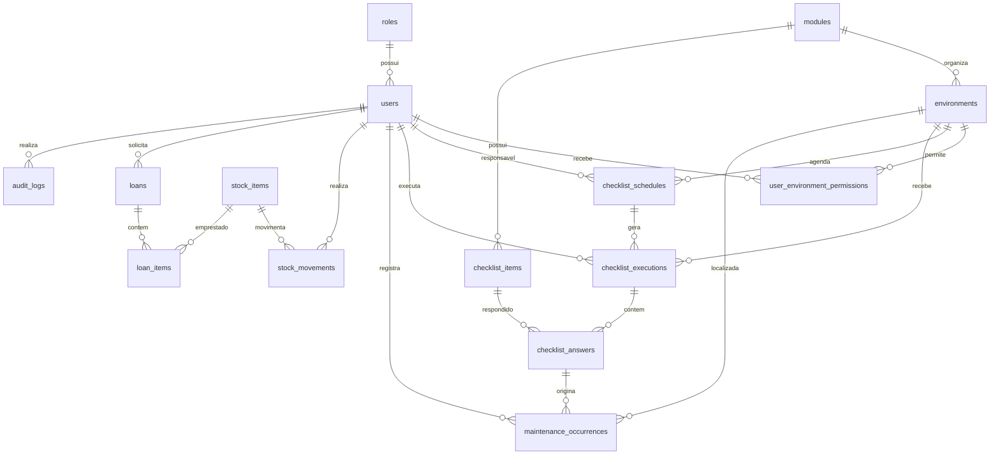

# SGA-Checklist - Documentacao tecnica

## Objetivo

Este documento descreve a arquitetura de dados planejada para substituir os dados estaticos e o `localStorage` do prototipo por uma API conectada a um PostgreSQL local executado com Docker.

A modelagem cobre os modulos atualmente apresentados pela interface:

- autenticacao, usuarios e perfis;
- ambientes e permissoes por ambiente;
- catalogo e execucao de checklists;
- ocorrencias e ordens de servico;
- almoxarifado, patrimonio e movimentacoes;
- emprestimos e devolucoes;
- programacao de checklists;
- auditoria.

## Arquitetura prevista



## Entidades

| Tabela | Responsabilidade |
| --- | --- |
| `roles` | Perfis de acesso do sistema. |
| `users` | Usuarios, credenciais e situacao de acesso. |
| `modules` | Agrupadores funcionais, como Sala de Aula e Almoxarifado. |
| `environments` | Locais monitorados, com bloco, capacidade e periodicidade padrao. |
| `user_environment_permissions` | Relacao entre usuarios e ambientes designados. |
| `checklist_items` | Catalogo configuravel de itens por modulo. |
| `checklist_schedules` | Rotinas agendadas para ambientes e responsaveis. |
| `checklist_executions` | Instancias executadas de um checklist. |
| `checklist_answers` | Respostas, observacoes e futuras evidencias de cada item. |
| `maintenance_occurrences` | Ocorrencias e ordens de servico geradas manualmente ou por checklist. |
| `stock_items` | Materiais, ferramentas, EPIs, equipamentos e patrimonio. |
| `stock_movements` | Entradas, saidas e ajustes de estoque. |
| `loans` | Cabecalho de um emprestimo e seus prazos. |
| `loan_items` | Itens e quantidades vinculados a um emprestimo. |
| `audit_logs` | Historico imutavel das operacoes relevantes. |

## Regras de integridade

1. Uma resposta com situacao `Parcialmente conforme`, `Nao conforme` ou `Nao verificado` deve possuir observacao.
2. Uma execucao nao pode ser finalizada enquanto houver item sem resposta.
3. Uma execucao finalizada nao pode ser alterada por usuario comum.
4. Uma resposta `Nao conforme` ou `Parcialmente conforme` pode gerar uma ocorrencia de manutencao.
5. O saldo de estoque nunca pode ficar negativo.
6. Codigos de ambientes e itens de estoque devem ser unicos.
7. Usuarios, ambientes e itens devem usar exclusao logica quando ja tiverem historico associado.
8. Operacoes de criacao, alteracao, finalizacao, movimentacao e encerramento devem gerar auditoria.
9. O encerramento de uma ocorrencia deve exigir validacao do responsavel pelo ambiente.
10. O banco deve armazenar datas em UTC e a interface deve exibir o horario local configurado.

## Decisoes de implementacao

- Banco: PostgreSQL.
- Execucao local: Docker Compose.
- Inicializacao: scripts SQL versionados e executados na criacao do container.
- Chaves: UUID para entidades de negocio e identificadores internos.
- Status e tipos: inicialmente como `CHECK constraints`, podendo evoluir para tabelas de dominio se houver necessidade de configuracao pelo usuario.
- Arquivos e fotos: fora do banco, com apenas metadados e URL armazenados em `checklist_answers` em uma etapa posterior.

## Proximas etapas

1. Criar `docker-compose.yml` com PostgreSQL e volume persistente.
2. Criar o script SQL inicial com extensoes, tabelas, indices, constraints e dados basicos.
3. Expandir a API local já criada e substituir os arrays fixos restantes da interface por chamadas HTTP.
4. Adicionar autenticacao real e controle de permissao no backend.
5. Criar testes para as regras de checklist, estoque e encerramento de ocorrencias.

## Execucao local do banco

### Pre-requisito

Instale o Docker Desktop para Windows e reinicie o terminal depois da instalacao. A instalacao pode ser feita pelo instalador oficial ou pelo Windows Package Manager:

```powershell
winget install --id Docker.DockerDesktop -e
```

Confirme que o Docker Desktop esta aberto e funcionando:

```powershell
docker version
docker compose version
```

### Subir o PostgreSQL

Na raiz do projeto, execute:

```powershell
docker compose up -d postgres
docker compose ps
```

As migrations em `doc_tec/sql` sao executadas automaticamente apenas na primeira criacao do volume. Para acompanhar a inicializacao:

```powershell
docker compose logs -f postgres
```

Conexao padrao para desenvolvimento:

```text
Host: localhost
Porta: 5432
Banco: sga_checklist
Usuario: sga
Senha: sga_local_dev
```

Para recriar o banco do zero durante o desenvolvimento, apagando os dados locais:

```powershell
docker compose down -v
docker compose up -d postgres
```

### Servidor da aplicacao

Com o PostgreSQL ativo, instale as dependencias e inicie o servidor na raiz do projeto:

```powershell
npm.cmd install
npm.cmd start
```

A aplicacao fica disponivel em `http://localhost:3000` e a API em `http://localhost:3000/api`. A rota `GET /api/health` valida a conexao com o banco; `GET /api/users` consulta os usuarios persistidos no PostgreSQL.

> Esta modelagem e a especificacao tecnica inicial. A implementacao SQL deve manter este documento atualizado quando houver mudanca de dominio.
